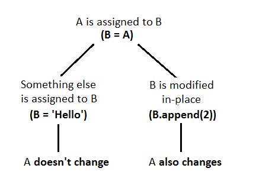

# cloaked-octo-computing-machine
Experimental_Python


**Linear Regression**

Example of how to make linear regression in python using scipy


**Pickle**

Stores python objects in files.
Useful to save processed data or training coefs for CNNs.

Note: Files generated with pickle for python 3 are not backward compatible for python 2.7

**Sample Generator**
Useful to generate more samples to train CNNs.


### How to solve the error in anaconda

> This application failed to start because it could not find or load the Qt platform plugin "xcb"
>in "".
>
>Reinstalling the application may fix this problem.
>Abortado ('core' generado)


As the message says we need to reinstall the program, the issue here is which program we need to reinstall.
This are the commands we need to run in order to fix this bug:

```
sudo /opt/anaconda3/bin/conda remove qt
sudo /opt/anaconda3/bin/conda remove pyqt
sudo /opt/anaconda3/bin/conda install qt
sudo /opt/anaconda3/bin/conda install pyqt
```

## Notes

### ternary operator:
```python
t="10" if 4 < 5 else "22"
```
### Dict max or min or any lambda:

```py
d = {'a':1, 'b':22, 'c':10}
print("Max val: {}".format(d[max(d, key=d.get)]))
```

### Debug
When there are several python versions in the same PC to specify which `pdb` should be used try:
```sh
python3 -m pdb <script_name>.py
# for python 2
python -m pdb <script_name>.py
```

#### References in python


[http://effbot.org/zone/call-by-object.htm](http://effbot.org/zone/call-by-object.htm)<br>
[http://effbot.org/zone/python-objects.htm](http://effbot.org/zone/python-objects.htm)<br>
<br>
Here is an example on how python hides memory:
```python
def dict_modifier(d, key):
  d.pop(key, None)

sample_dict = {'some_key': 'some value'}
dict_modifier(sample_dict, 'some_key')
print(sample_dict)  # {}
```

The function `dict_modifier` removes a value form the dictionary passed to it, it handles the dictionary as a reference.
But python not always takes the arguments as references for example:
```python
def adder(n):
  n += 1

i = 1
adder(i)
print(i)  # 1
```
The primitives are **not** passed as references, but rather as copies.

#### Compile a python script for correctness
```
python -m py_compile xpad_diag_helper.py
```

#### Get import paths
[https://stackoverflow.com/questions/5751292/how-to-get-current-import-paths-in-python](https://stackoverflow.com/questions/5751292/how-to-get-current-import-paths-in-python)

The path locations that python cheks by default can be inspected in sys.path.

```python
import sys
print sys.path
```

#### [Class (static) variables in python](https://stackoverflow.com/questions/68645/static-class-variables-in-python)

A static variable is a variable which is shared among all the instances of the class, if its
value changes, changes for all the instances. Also does NOT need an instance of the class
to exists.<br>
For example:
```python
class A:
  static_variable = "I exist"
  def __init__(self):
    self.non_static_var = "I need an instance to exist"
print(A.static_variable)
print(A.non_static_var)
```

Every object can access the static variable
```python
class B:
  shared_var = "I'm shared"
  def __init__(self):
    self.instance_only_var = "Im only for my object"

ib_1 = B()
ib_2 = B()
print(B.shared_var)

print(ib_2.shared_var)
print(ib_1.shared_var)
ib_2.shared_var = "catorce"

print(ib_2.shared_var)
print(ib_1.shared_var)
####
print(ib_2.instance_only_var)
print(ib_1.instance_only_var)
ib_2.instance_only_var = "only for ib2"
print(ib_2.instance_only_var)
print(ib_1.instance_only_var)
```

```python
```


### Get the value in little endian of an instruction:
```python
'/bin/sh'[::-1].encode().hex()
'68732f6e69622f'
```


### Why python sucks

- The Python interpreter is not thread safe, so multithreading doesn't actually work (https://wiki.python.org/moin/GlobalInterpreterLock)
- Python contains features that are known to just plain not work
    - round doesn't actually round numbers. (https://docs.python.org/2/library/functions.html#round)  The notion of rounding a base10 number is fundamentally a base10 operation.  Why the hell would you try to do it in base 2?
    - os.path.commonprefix doesn't actually return valid paths (https://docs.python.org/2/library/os.path.html#os.path.commonprefix)
- Python's regex engine is obtuse and slow (http://glennklockwood.blogspot.com/2012/04/revisiting-perl-and-python-speed.html)
- MAJOR changes between MINOR revisions (2.6, 2.7)
    - subprocess.check_output
    - the "with" statement
- MAJOR changes between 2.0 and 3.0, like redefining fundamental math operations (https://www.python.org/dev/peps/pep-0238/)
- Time doesn't work
    - e.g., time.strftime("%Y-%m-%d %H:%M:%S", time.localtime(int(time.strftime("%s", time.gmtime()))))
    - good luck trying to get a datetime.tzinfo object for the local timezone (http://stackoverflow.com/questions/1681143/how-to-get-tz-info-object-corresponding-to-current-timezone)
- is neither pass-by-value vs pass-by-reference
    - programmer has to mentrally track the mutability of the type of object being passed around
    - this, combined with Python's lack of strong typing, make this a really fragile way to program
