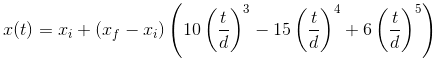
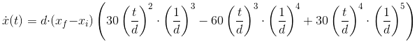

# Deceleration

Snippet to create a deceleration target velocities for nanodegree.
The input is current velocity
    - The speed of the vehicle we want to stop
current pose
    - The position of the vehicle
final pose
    - The position where the vehicle has to have the target velocity

The purpose is to create an algorithm such as the generated velocities
do not exceed a jerk > 10 m/s^3

Steps:
    * keep a buffer of the 10 past velocities
    * with the information given in the buffer calculate a spline
      which ends at the desited position and the desired speed (0)
(src)[https://docs.scipy.org/doc/numpy-1.13.0/reference/generated/numpy.interp.html]

https://mml-book.github.io/

## Generating minimal jerk trajectories

The minimum jerk trajectory is based on minimizing the sum of the squared jerk
(time derivate or the acceleration) along its trajectory. 

The result of the derived equation for the position is:

Where:

* <i>xi</i> : Current position (Distance m, rads)
* <i>xf</i> : set point (Distance: m, rads)
* <i>t</i> : travel time
* <i>d</i> : duration of movement from <i>xi</i> to <i>xf</i>

The velocity trajectory can be found by deriving the last equiation:

- - - 

The trajectory is minimal jerk if has 5th derivate. (?)